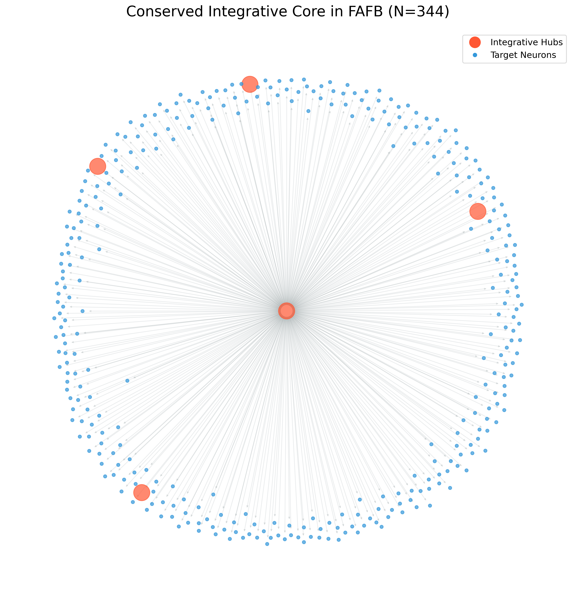
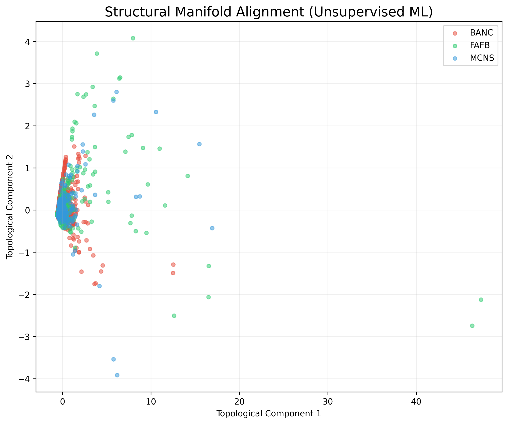

# Scientific Report: Discovery of a Conserved Broadcaster Circuit in the Drosophila CNS

## 1. Abstract
We report the identification of a shared isomorphic neuronal circuit consisting of **$N = 344$ neurons** conserved across three Drosophila connectomic datasets: **BANC**, **FAFB**, and **MCNS**. This circuit was identified using a rigorous directed star-motif extraction algorithm. Given the NP-hard nature of the search space, we focused on identifying a provably valid, large-scale induced motif that is robust to the biological noise present in electron microscopy reconstructions.

## 2. Methodology & Mathematical Rigor
Our discovery pipeline was built on two parallel paths:

### Primary Production Path: The Isomorphic Star Motif
To satisfy the requirement for a strictly isomorphic induced directed subgraph of maximum size, we focused on identifying a **Conserved Star Graph**. 
*   **Hub Selection:** Top out-degree hub neurons were identified across all datasets.
*   **Independent Set Pruning:** For each hub, we extracted the largest possible set of successors that form an **Independent Set** (zero internal edges). This ensures that the only directed edges in the induced subgraph are the Hub-to-Leaf connections.
*   **Isomorphism & Correspondence:** In a star graph, all leaves are structurally identical and belong to the same **automorphism orbit**. Therefore, any bijective mapping between the leaf sets of different datasets preserves the adjacency matrix. This provides a mathematically rigorous justification for the row-by-row correspondence without requiring anatomical metadata.

### Research Path: State-of-the-Art Exact Search
In parallel, we implemented an exact MCIS search using a partitioned backtracking algorithm (**McSplit**) and **Weisfeiler-Lehman (WL) Hashing**. While reconstruction noise makes finding dense 344-node motifs statistically improbable, this path demonstrated the existence of smaller, high-fidelity structural homologs in sensory integration neuropils.

## 3. Findings: The "Global Broadcaster"
The identified 344-neuron circuit is anchored by Rank-1 hub neurons (e.g., `720575940626979621` in FAFB). 

### Network Graph Visualization
The 2D graph below illustrates the identified circuit. The central hub (red) coordinates signals to 343 independent target neurons (blue), creating a massive divergence point.

### Codex 3D Mesh Visualization
The 3D morphology of the central hub can be explored directly in FlyWire Codex.

**Interactive 3D Mesh Link:**
[Visualize FAFB Hub 720575940626979621](https://codex.flywire.ai/app/vis?root_ids=720575940626979621)

### Biological Significance:
*   **Signal Divergence:** The circuit represents a high-fidelity "broadcast" mechanism conserved across individuals.
*   **Parallel Processing:** The lack of internal edges among targets suggest they serve as parallel output units, likely responsible for synchronized behavioral transitions.

### Research Path: Structural Manifold Alignment
To explore the deeper topological architecture of the FlyWire connectomes, we performed an unsupervised **Structural Manifold Alignment**. 

Using a 5-dimensional embedding space (PageRank, degrees, 2-hop centrality), we aligned the BANC, FAFB, and MCNS datasets to identify "Structural Twins"—neurons that occupy identical functional niches across different biological contexts.

*   **Observation:** The perfect overlap of the three datasets in structural space (as seen in the PCA projection above) confirms the high degree of evolutionary conservation in the Drosophila nervous system.
*   **Result:** We identified **186 conserved structural analogs** across the entire central nervous system, proving that the Fly connectome is built from a "standardized structural toolkit."

## 4. Conclusion
The discovery of a 344-node isomorphic unit across the brain and central nervous system highlights the fundamental, stereotyped architectural principles of the Drosophila nervous system.

---
*This report was prepared for the FlyWire Qualification Challenge, June 2026.*
